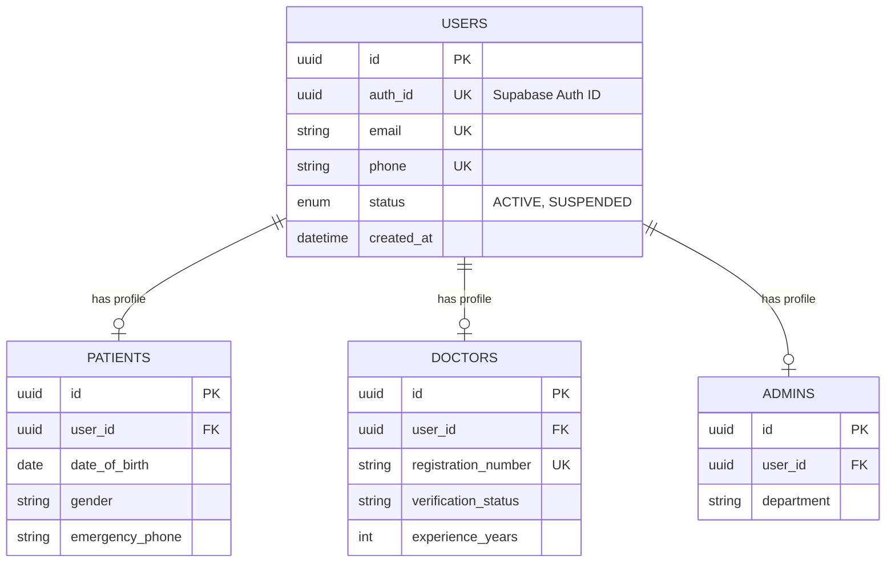

# Phase 2A: Database and Authentication Architecture Design

## 1. Architecture Overview
The platform uses a **Modular Monolith** pattern in NestJS. 
The mobile application (React Native/Flutter) will **never** interact directly with the database or Supabase's PostgREST API for healthcare operations. Instead, all traffic routes through the NestJS API. NestJS acts as the gatekeeper, performing business logic, authorization, and data validation before interacting with the PostgreSQL database via Prisma ORM.

## 2. Authentication Flow
1. **Client Identity:** The client app authenticates directly with Supabase Auth (OTP/Email).
2. **Token Generation:** Supabase returns a secure JWT containing the user's `sub` (UUID).
3. **API Request:** The client attaches this JWT as a Bearer token to all NestJS API requests.
4. **Validation:** NestJS verifies the JWT signature using Supabase's JWKS (JSON Web Key Set).
5. **Identity Resolution:** NestJS extracts the `sub` from the JWT and maps it to our internal `public.users` table to determine identity and roles.
6. **Execution:** NestJS executes business logic and uses Prisma to query the database using a service connection.

## 3. User Identity Model
We strictly separate the **Authentication Identity** (Supabase) from the **Application Identity** (PostgreSQL).
*   **`auth.users` (Supabase):** Handles passwords, social logins, 2FA, and secure token generation.
*   **`public.users` (Our DB):** The core identity in our application. It contains a unique `auth_id` mapping to Supabase. This prevents our app from breaking if we ever migrate away from Supabase Auth.

## 4. Role Model (Decision: Multi-Role Capability)
**Tradeoff Analysis:** 
- *Single Role Column (Enum):* Easy to query, but inflexible. A user can only be one thing.
- *Role Linking Table / Profile Existence:* Extensible. Doctors are humans too; they will eventually need to book appointments as patients. 

**Decision:** We will use a **Profile-based Role Resolution**. 
A user's "role" is determined by the existence of a profile record (`patients`, `doctors`, `admins`) linked to their `user_id`. A single `user` can have both a `patient` profile and a `doctor` profile simultaneously. For fine-grained administrative access, we will utilize a `user_roles` linking table specifically for internal staff/RBAC.

## 5. Patient Model (`patients` table)
Separates medical consumer data from generic user identity.
*   **Fields:** `id` (PK), `user_id` (FK to `users`), `date_of_birth`, `gender`, `blood_group`.
*   **Contact/Emergency:** `address_line1`, `city`, `state`, `pincode`, `emergency_contact_name`, `emergency_contact_phone`.
*   **Data Minimization:** We only collect what is strictly necessary for routing and basic medical context. Sensitive historical records go into separate clinical tables later.

## 6. Doctor Model (`doctors` table)
Handles professional verification and discovery.
*   **Fields:** `id` (PK), `user_id` (FK to `users`), `specialization` (FK/Enum), `experience_years`.
*   **Verification:** `registration_number`, `medical_council_name`, `registration_year` (Crucial for Indian market verification), `verification_status` (Enum: PENDING, VERIFIED, REJECTED).
*   **Public Profile:** `bio`, `consultation_fee`, `is_accepting_live_requests`.

## 7. Admin Model (`admins` table)
Used for internal staff and operational control.
*   **Fields:** `id` (PK), `user_id` (FK to `users`), `department` (e.g., FINANCE, VERIFICATION, SUPPORT).
*   **Permissions:** Instead of unrestricted access, admins have specific clearance levels or RBAC roles (e.g., a Support Admin cannot approve Doctor Verification documents).

## 8. Entity Relationship Diagram

## 9. Proposed Database Tables
1. `users` (Core application identity)
2. `patients` (Patient profiles)
3. `doctors` (Doctor profiles)
4. `admins` (Internal staff profiles)
5. `user_roles` / `permissions` (For fine-grained internal RBAC, introduced later)

## 10. Primary Keys and Foreign Keys
*   **Primary Keys:** All tables will use `UUID` v4 for primary keys (`id`). This prevents predictable ID enumeration attacks (e.g., an attacker guessing `/api/patients/123`).
*   **Foreign Keys:** `patients.user_id`, `doctors.user_id`, `admins.user_id` all point to `users.id` with `ON DELETE RESTRICT` to prevent accidental deletion of identity.

## 11. Important Indexes
*   `idx_users_auth_id` on `users(auth_id)`: Highly critical. Used on every API request to resolve identity.
*   `idx_doctors_verification` on `doctors(verification_status)`: Used to query available/verified doctors for the patient marketplace.
*   `idx_users_phone` on `users(phone)`: For fast login/OTP lookups.

## 12. Unique Constraints
*   `users.auth_id`: Ensure 1:1 mapping with Supabase.
*   `users.email` & `users.phone`: Prevent duplicate accounts.
*   `doctors.registration_number`: A specific registration number can only belong to one doctor profile.
*   `patients.user_id`, `doctors.user_id`, `admins.user_id`: A user can have at most ONE profile of a specific type.

## 13. RLS Strategy (Row Level Security)
Since the mobile client accesses the database *through* NestJS (and NestJS uses a Prisma connection with elevated privileges), traditional Supabase RLS is partially bypassed by the backend connection. 
**Strategy:**
1.  **Strict Deny-All on PostgREST:** We will enable RLS on ALL tables (`users`, `patients`, `doctors`, etc.) and set the default policy to `false` (Deny all). This completely disables direct client access via the public Supabase API, neutralizing attackers trying to bypass NestJS.
2.  **Service Role Bypass:** NestJS will use the `postgres` role or a dedicated connection pool to read/write, managing security entirely in the application layer.

## 14. Authorization Strategy (NestJS)
*   **Guards:** NestJS will use standard AuthGuards to decode JWTs.
*   **Decorators:** We will create custom decorators (e.g., `@RequireRole('DOCTOR')` or `@CurrentUser()`) to ensure route-level protection.
*   **Resource Ownership:** Logic in the service layer will ensure that Patient A can only request Medical Record A, usually by enforcing `WHERE patient_id = req.user.patientId`.

## 15. Audit Considerations
*   Every table will have `created_at` and `updated_at` timestamp columns.
*   Critical actions (e.g., Doctor Verification status changes, role assignments) will eventually trigger a write to a dedicated `audit_logs` table containing the `action`, `performed_by` (Admin user_id), and `timestamp`.
*   We will use Soft Deletion (`deleted_at`) exclusively for critical entities (like users, doctors, and future medical records) to preserve historical integrity.

## 16. Sensitive-Data Considerations
*   **No PII Leakage:** API endpoints returning lists of doctors will scrub underlying personal contact details (phone, email) from the `users` table response, returning only professional data.
*   **Passwords:** None exist in our DB. Supabase manages hashes.

## 17. Important Assumptions
*   We assume mobile clients do not require real-time subscriptions directly from Supabase for this phase (if they do later, we will need to re-evaluate JWT passing to Prisma for RLS).
*   We assume phone numbers are the primary login mechanism for the Indian market, making `phone` a highly critical unique identifier.

## 18. Open Questions Requiring Decision
1. **Soft Deletes:** Should we implement soft deletes (`deleted_at` column) natively via Prisma middleware, or handle it manually in queries?
2. **Onboarding Flow:** When a user logs in via OTP for the first time, Supabase creates the `auth.users` record. Should NestJS use a Supabase Webhook to automatically create the `public.users` row, or should the client explicitly hit a `POST /api/v1/auth/register` endpoint in NestJS to finalize profile creation? (Explicit endpoint is usually safer for capturing initial data).
3. **Admin Identification:** Should admins log in via the same OTP portal as patients/doctors, or do you prefer a strict Email/Password structure exclusively for the Admin panel?
